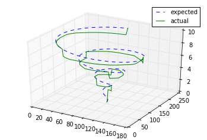

```

+ 3d centerline extraction demo using geodesic distance transform in Python - see extract_centerline.py

+ ** work-in-progress ** Extract oblique 2d slice (or 3d slab) from volume with SimpleITK - see extract_slice.py

```

#### Usage
	
see `demo.ipynb` for usage.
	
```
# extract centerline between 2 points given a binary 3d mask
centerline_list = extract_centerline(img,start_point,end_point)
```




#### Reference

Teng, Pang-yu, Ahmet Murat Bagci, and Noam Alperin. "Automated prescription of an optimal imaging plane for measurement of cerebral blood flow by phase contrast magnetic resonance imaging." IEEE Transactions on Biomedical Engineering 58.9 (2011): 2566-2573.
https://www.ncbi.nlm.nih.gov/pubmed/21672671

#### wip
```
docker build -t wip .
docker run -it -p 8888:8888 -w $PWD -v $PWD:$PWD wip bash

```